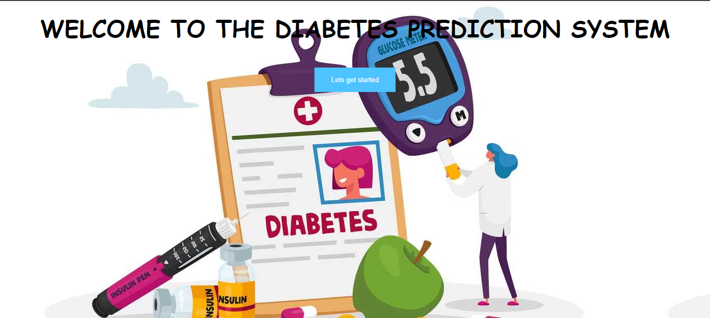
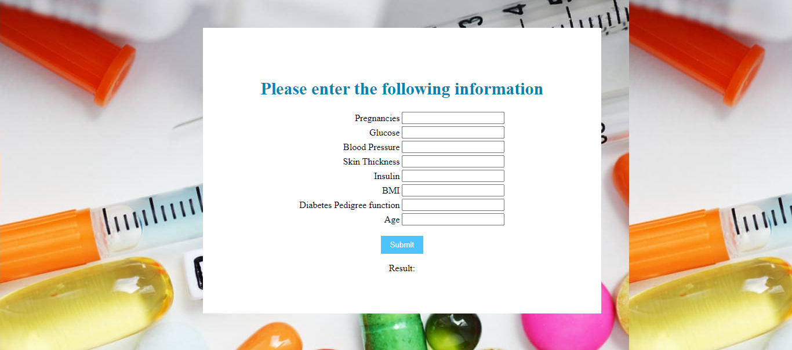

# Diabetes-Prediction-System

## Objective

Original dataset    :  https://archive.ics.uci.edu/ml/datasets/diabetes

Kaggle Competitions :  https://www.kaggle.com/uciml/pima-indians-diabetes-database

## Overview
-Made a website for diabetes prediction for a random patient with the help of different attributes or
parameter (such as BMI,Glucose,BP,etc) for detecting whether the person is having diabetes or not.
- Extracted the data from given dataset on Kaggle by National Institute of Diabetes.
- Implemented using Logistic Regression, analysed their performances during the project and developed a
locally hosted python based web app for the purpose of prediction for a given patient.
- Implemented the project using Python libraries and framework such as Numpy, Pandas, Sklearn and
deployed using Django.itage.


### Techniques Used

- Data Cleaning
- Data Visualization
- Machine Learning Modeling

### Algortihms Used

1. Logistic Regression


### Accuracy We got

1. Logistic Regression		: 77.92%


### Screenshot




## Installation
- Clone this repository and unzip it.

- After downloading, `cd` into the `Deployment` directory.

- Begin a new virtual environment with Python 3 and activate it.

- Install the required packages using 
   `pip install -r requirements.txt`

- Execute the command:
   `python manage.py runserver`

- Open http://127.0.0.1:8000/ in your browser.

## Guide Lines 

### Packages and Tools Required:
```
Pandas 
Matplotlib
Seaborn
Scikit Learn
Jupyter Notebook
Django
```
### Package Installation
```
pip3 install -r requirements.txt
```
